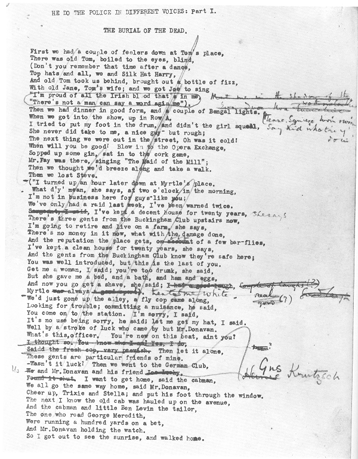

##T.S. Eliot, "The Waste Land" (1922)

 

###English Literature 2

###Monday 13 March 2017 

 

###Dr Anouk Lang

###anouk.lang@ed.ac.uk 

----	
##Lecture overview

* Introduction and recurrent imagery
* Fertility myths
* Intertextual and mythic references
* The depiction of the city
* Art and the response to modernity 
* The instability of language and poetic form
* "He Do the Police in Different Voices"
---
##Recurrent imagery 

* the tarot cards / chance and uncertainty
* resurrection and rebirth
* water imagery
---
##Fertility myths

  April is the cruellest month, breeding
Lilacs out of the dead land, mixing 
Memory and desire, stirring 
Dull roots with spring rain. 
Winter kept us warm, covering 
Earth in forgetful snow, feeding 
A little life with dried tubers. 
----
Summer surprised us, coming over the Starnbergersee 
With a shower of rain; we stopped in the colonnade, 
And went on in sunlight, into the Hofgarten, 
And drank coffee, and talked for an hour. 
Bin gar keine Russin, stamm' aus Litauen, echt deutsch. 
And when we were children, staying at the arch-duke's, 
My cousin's, he took me out on a sled, 
And I was frightened. He said, Marie, 
Marie, hold on tight. And down we went. 
In the mountains, there you feel free. 
I read, much of the night, and go south in the winter. 
----	
What are the roots that clutch, what branches grow
Out of this stony rubbish? Son of man,
You cannot say, or guess, for you know only
A heap of broken images, where the sun beats,
And the dead tree gives no shelter, the cricket no relief,
And the dry stone no sound of water. 
----
Above the antique mantel was displayed 
As though a window gave upon the sylvan scene 
The change of Philomel, by the barbarous king 
So rudely forced; yet there the nightingale 
Filled all the desert with inviolable voice 
And still she cried, and still the world pursues, 
"Jug Jug" to dirty ears. 
----
Twit twit twit 
Jug jug jug jug jug jug 
So rudely forc'd. 
Tereu
----
At the violet hour, when the eyes and back 
Turn upward from the desk, when the human engine waits 
Like a taxi throbbing waiting, 
I Tiresias, though blind, throbbing between two lives, 
Old man with wrinkled female breasts, can see 
At the violet hour, the evening hour that strives 
Homeward, and brings the sailor home from sea, 
The typist home at teatime, clears her breakfast, lights 
Her stove, and lays out food in tins. 
----
The time is now propitious, as he guesses, 
The meal is ended, she is bored and tired, 
Endeavours to engage her in caresses 
Which still are unreproved, if undesired. 
Flushed and decided, he assaults at once; 
Exploring hands encounter no defence; 
His vanity requires no response, 
And makes a welcome of indifference. 
(And I Tiresias have foresuffered all 
Enacted on this same divan or bed ...
----
Out of the window perilously spread 
Her drying combinations touched by the sun's last rays, 
On the divan are piled (at night her bed) 
Stockings, slippers, camisoles, and stays. 
 
... Can poetry's traditional resources, rhythm and rhyme, suffice for what the modern world can throw in its path: a typist, her room, a scene of urban squalor? 

#####Lawrence Rainey, "With Automatic Hand: The Waste Land," *The Cambridge Companion to T.S. Eliot*, ed. Jason Harding (Cambridge: Cambridge UP, 2016) 79.
----
You ought to be ashamed, I said, to look so antique. 
(And her only thirty-one.)
I can't help it, she said, pulling a long face, 
It's them pills I took, to bring it off, she said. 
(She's had five already, and nearly died of young George.) 
The chemist said it would be all right, but I've never been the same. 
You *are* a proper fool, I said. 
Well, if Albert won't leave you alone, there it is, I said, 
What you get married for if you don't want children? 
---
##Intertextual and mythic references

In using the myth, in manipulating a continuous parallel between contemporaneity and antiquity, Mr. Joyce is pursuing a method which ... [is] a way of controlling, of ordering, of giving a shape and a significance to the immense panorama of futility and anarchy which is contemporary history ... Instead of narrative method, we may now use the mythical method. It is, I seriously believe, a step toward making the modern world possible for art ...

#####T.S. Eliot, 'Ulysses, order and myth', *The Dial* 75 (1923): 483.
----
Whan that Aprill with his shoures soote
   The droghte of March hath perced to the roote,
   And bathed every veine in swich licour
   Of which vertu engendred is the flour,
Whan Zephirus eek with his sweete breeth
   Inspired hath in every holt and heeth
   The tendre croppes, and the yonge sonne
   Hath in the Ram his halve cours yronne,
   And smale foweles maken melodye,
That slepen al the night with open eye  ...

#####from the General Prologue to the *Canterbury Tales*
----

----

----
 "My nerves are bad tonight. Yes, bad. Stay with me.
"Speak to me. Why do you never speak. Speak.
  "What are you thinking of? What thinking? What?
"I never know what you are thinking. Think."
...
  "What is that noise?"
                          The wind under the door.
"What is that noise now? What is the wind doing?"
                           Nothing again nothing.
----
   I remember
Those are pearls that were his eyes.
"Are you alive, or not? Is there nothing in your head?"  
           
                                                                           But

O O O O that Shakespeherian Rag—
It's so elegant
So intelligent
"What shall I do now? What shall I do?"
"I shall rush out as I am, and walk the street
"With my hair down, so. What shall we do tomorrow?
"What shall we ever do?"
----
Goonight Bill. Goonight Lou. Goonight May. Goonight. 
Ta ta. Goonight. Goonight. 
Good night, ladies, good night, sweet ladies, good night, good night. 
----
"This music crept by me upon the waters" 
And along the Strand, up Queen Victoria Street. 
O City city, I can sometimes hear 
Beside a public bar in Lower Thames Street, 
The pleasant whining of a mandoline 
And a clatter and a chatter from within 
Where fishmen lounge at noon: where the walls 
Of Magnus Martyr hold 
Inexplicable splendour of Ionian white and gold. 
----
Ganga was sunken, and the limp leaves 
Waited for rain, while the black clouds 
Gathered far distant, over Himavant. 
The jungle crouched, humped in silence. 
Then spoke the thunder 
DA 
*Datta:* what have we given? 

 ...

Datta. Dayadhvam. Damyata.

                  Shantih     shantih     shantih
---
##Depictions of the city

His soul stretched tight across the skies 
That fade behind a city block, 
Or trampled by insistent feet 
At four and five and six o'clock; 
And short square fingers stuffing pipes, 
And evening newspapers, and eyes 
Assured of certain certainties, 
The conscience of a blackened street 
Impatient to assume the world. 

#####Eliot,  "Preludes"
----
  Unreal City, 
Under the brown fog of a winter dawn, 
A crowd flowed over London Bridge, so many, 
I had not thought death had undone so many. 
Sighs, short and infrequent, were exhaled, 
And each man fixed his eyes before his feet. 
Flowed up the hill and down King William Street, 
To where Saint Mary Woolnoth kept the hours 
With a dead sound on the final stroke of nine. 
---
Then spoke the thunder
DA 
*Datta:* what have we given? 
My friend, blood shaking my heart 
The awful daring of a moment's surrender 
Which an age of prudence can never retract 
By this, and this only, we have existed 
Which is not to be found in our obituaries 
Or in memories draped by the beneficent spider 
Or under seals broken by the lean solicitor 
In our empty rooms
----
*Damyata:* The boat responded 
Gaily, to the hand expert with sail and oar 
The sea was calm, your heart would have responded 
Gaily, when invited, beating obedient 
To controlling hands 
----
What is the city over the mountains 
Cracks and reforms and bursts in the violet air 
Falling towers 
Jerusalem Athens Alexandria 
Vienna London 
Unreal 
---
##Art and the response to modernity
 
  What are the roots that clutch, what branches grow 
Out of this stony rubbish? Son of man, 
You cannot say, or guess, for you know only 
A heap of broken images, where the sun beats, 
And the dead tree gives no shelter, the cricket no relief, 
And the dry stone no sound of water.
----
  I sat upon the shore 
Fishing, with the arid plain behind me 
Shall I at least set my lands in order? 
London Bridge is falling down falling down falling down 
*Poi s'ascose nel foco che gli affina 
Quando fiam uti chelidon*—O swallow swallow 
*Le Prince d'Aquitaine à la tour abolie*
These fragments I have shored against my ruins 
Why then Ile fit you. Hieronymo's mad againe. 
Datta. Dayadhvam. Damyata.
                  Shantih     shantih     shantih 
---
##The instability of language and poetic form

London Bridge is falling down falling down falling down 
*Poi s'ascose nel foco che gli affina 
Quando fiam uti chelidon*—O swallow swallow 
*Le Prince d'Aquitaine à la tour abolie*
These fragments I have shored against my ruins 
Why then Ile fit you. Hieronymo's mad againe. 
Datta. Dayadhvam. Damyata.
                  Shantih     shantih     shantih 
----
Twit twit twit 
Jug jug jug jug jug jug 
So rudely forc'd. 
Tereu 

... 

The barges wash 
Drifting logs 
Down Greenwich reach 
Past the Isle of Dogs. 
           Weialala leia 
           Wallala leialala
----
He'll want to know what you done with that money he gave you 
To get yourself some teeth. He did, I was there. 
You have them all out, Lil, and get a nice set, 
He said, I swear, I can't bear to look at you. 
And no more can't I, I said, and think of poor Albert, 
He's been in the army four years, he wants a good time, 
And if you don't give it him, there's others will, I said. 
Oh is there, she said. Something o' that, I said. 
Then I'll know who to thank, she said, and give me a straight look. 
---
##"He Do the Police in Different Voices"

#####*The Waste Land: A Facsimile and Transcript of the Original Drafts*, ed. Valerie Eliot (New York: Harcourt Brace Jovanovich, 1971).
----

#####*The Waste Land: A Facsimile and Transcript of the Original Drafts*, ed. Valerie Eliot (New York: Harcourt Brace Jovanovich, 1971).
